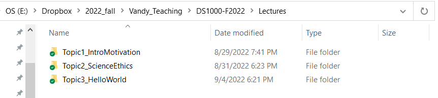
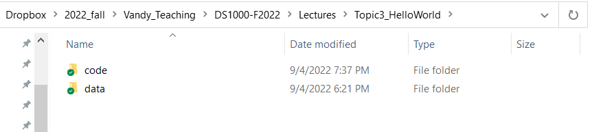

```{css,echo = F}
.small .remark-code { /*Change made here*/
  font-size: 85% !important;
}
.tiny .remark-code { /*Change made here*/
  font-size: 50% !important;
}
```

```{r,include=F}
set.seed(123)
options(width=60)
knitr::opts_chunk$set(fig.align='center',fig.width=9,fig.height=5)
def.chunk.hook  <- knitr::knit_hooks$get("chunk")
knitr::knit_hooks$set(chunk = function(x, options) {
  x <- def.chunk.hook(x, options)
  ifelse(options$size != "normalsize", paste0("\n \\", options$size,"\n\n", x, "\n\n \\normalsize"), x)
})
```

# Agenda

1. Getting set up

--

  - Folder structure + `setwd()`
  
--

2. Installing software

--

  - [`R: https://cran.r-project.org/`](https://cran.r-project.org/)
  
--

  - [`RStudio: https://rstudio.com/products/rstudio/download/`](https://rstudio.com/products/rstudio/download/)

--

3. Requiring packages

--

  - `install.packages("tidyverse")` 

--

  - `require(tidyverse)`
  
--

4. Loading and manipulating data

--

  - `readRDS()`
  
--

  - `%>%`

---

# Getting set up

--

- Folder structure + `setwd()`

--

  - Concept: keep everything together...
  
--

  - ...and **related**

--

.center[]


---

# Getting set up

- Folder structure + `setwd()`

  - Concept: keep everything together...

  - ...and **related**

.center[]


---

# Installing software

--

- [`R: https://cran.r-project.org/`](https://cran.r-project.org/)

  - Accept all defaults
  
--

- [`RStudio: https://rstudio.com/products/rstudio/download/`](https://rstudio.com/products/rstudio/download/)

  - Download the version for your OS
  
--

- Open `RStudio` and create a new rmarkdown (`.Rmd`) file

--

  - Accept defaults, give it a sensible name, delete the default text, then save it to your folder (again with a sensible name)
  
--

  - You should follow along with the lecture in this file! Take notes here! Try code here!

---

# How to type in `.Rmd`
````{verbatim, lang = "markdown"}
# This is a header

## This is a subheader

### This is a subsubheader

This is plain text.
````
--

# This is a header

## This is a subheader

### This is a subsubheader

This is plain text.


---

# How to type in `.Rmd`
````{verbatim, lang = "markdown"}
- This is

- a bulleted

  - List

1. This is

2. a numbered list
````

--

- This is

- a bulleted

  - List

1. This is

2. a numbered list

---

# How to type in `.Rmd`
````{verbatim, lang = "markdown"}
**Bold font**, *italic font*, `code font`
````
--

**Bold font**, *italic font*, `code font`

--

- Most Importantly! `R` code!

````{verbatim, lang = "markdown"}
```{r}
2+2
```
````

--

```{r}
2+2
```

---

# How `R` Works

--

- **O**bject **O**riented **L**anguage (**OOL**)

--

  - Objects are created with the `<-` command
  
--

  - You *can* run code directly...
  

```{r}
2+2
```

---

# How `R` Works


- **O**bject **O**riented **L**anguage (**OOL**)

  - Objects are created with the `<-` command

  - ...but most of what we'll do involves objects
  

```{r}
object1 <- 2+2
object1
```

---

# How `R` Works


- **O**bject **O**riented **L**anguage (**OOL**)

  - Objects are created with the `<-` command

  - They can be named anything (so be intuitive!)
  

```{r}
three_plus_three <- 2+2
three_plus_three
```

---

# How `R` Works

- **O**bject **O**riented **L**anguage (**OOL**)

  - Objects are created with the `<-` command

  - Objects can store many different things
  
```{r}
an_element <- 2+2
a_vector <- c(1,2,3)
a_list <- list('element1' = 2+2,
               'element2' = "hello world!",
               'element3' = runif(n = 10,min = 0,max = 10))
a_function <- function(x) {
  avg_of_x <- sum(x) / length(x)
  return(avg_of_x)
}
```

---

# How `R` Works

- Objects **persist!**
```{r}
an_element # This object stores 2+2
a_vector   # This object stores the integers 1, 2, and 3

an_element*a_vector
an_element-a_vector
```

---

# How `R` Works

- Objects **persist!**
```{r}
# This object stores:
  # 1) 2+2 (named "element1")
  # 2) the text "hello world!" (named "element2")
  # 3) 10 numbers randomly drawn between 0 and 10
a_list
```

---

# How `R` Works

- Objects **persist!**
```{r}
# Let's apply our function ("a_function") to "element3" in "a_list"
a_function(x = a_list[['element3']])
```

--

- We could also call `element3` from `a_list` with a \$ sign

```{r}
a_function(x = a_list$element3)
```

---

# How `RStudio` Works

--

- `RStudio` is a powerful way to interact with `R`

--

- In base `R`, you interact with the program via the "command line"

--

  - For example...
  
--

- But to save your work, you can write "scripts"

--

  - For example...
  
--

- *This is all cumbersome!*

--

- Enter, `RStudio`

---

# How `RStudio` Works

--

- `RStudio` allows us to:

--

  1. Write scripts
  2. Run scripts
  3. See results

--

- It is **deeply interactive**

--

  - We can highlight a line and press `ctrl+enter` / `cmd+enter` and see the result
  
--

  - **We can even do this with single objects!**
  
---

# Functions & Packages

--

- What are `packages`?

--

  - Basically, **functions** that someone else wrote
  
--

- `R` has many functions already installed

--

  - These are known as "base `R`" and contain many useful functions

--

  - For example, `sum()` will add up a vector of numbers

--

```{r,echo=TRUE,eval=FALSE}
sum(object1)
```
  
--

  - Quiz: What does the `mean()` function do? The `median()`? The `range()`?
  
--

- Other base `R` functions interact with other files

--

  - For example, `read.csv()` will load a `.csv` file
  
--

- And there are MANY **MANY** more

---

# Installing Packages

--

- In addition to the functions included in base `R`, we want more

--

- For this class, we want one called `tidyverse`

--

  - `tidyverse` contains many (hundreds?) of functions that make `R` easier
  
--

  - But it is NOT included in the base `R` set of functions
  
--

  - Therefore, we need to add it
  
--

- Use the base `R` function `install.packages("[PACKAGE NAME]")`

--

  - Specifically, `install.packages("tidyverse")`
  
---

# Requiring Packages

--

- Once installed, a package will live somewhere on your computer

--

- However, any new *instance* of `R` will not automatically load the packages

--

- We need to `require()` them to tell `R` to load them

--

  - Alternatively, we can use `library()` (but it's the same result)
  
--

- So load the `tidyverse` package with `require(tidyverse)`

```{r,echo=FALSE,warning=FALSE,message=FALSE}
require(tidyverse)
```

--

  - NB: you need quotes for the `install.packages()` function...
  
--

    - i.e., `install.packages("tidyverse")`
    
--

  - but NOT for the `require()` function
  
--

    - i.e., `require(tidyverse)`
  
---

# Loading Data

--

- So you should be using `R` via `RStudio` with the `tidyverse` package loaded

--

- Now let's load some data

--

- First, download the `sc_debt.Rds` file from the course [github page](https://github.com/jbisbee1/DS1000_S2023/blob/main/Lectures/2_Intro_to_R/data/sc_debt.Rds)

--

  - Save it to the `./data` folder that you created
  
--

- Second, load the data with `readRDS("[PATH TO DATA]/sc_debt.Rds")`

--

  - NB: `R` is an "object-oriented language" (OOL)

--

  - We **create** an "object" to store the data using a left-arrow: `<-`

--

```{r}
df<-readRDS("../data/sc_debt.Rds")
```

--

  - `../` means "go up one folder"

---

# Loading Data

--

- We now have the contents of `sc_debt.Rds` stored in the object `df`

--

- We can look at this object directly

```{r}
df
```

---

# Loading Data

--

- Or we can look at its columns

```{r}
names(df)
```

---

# Loading Data

--

```{r,echo=FALSE,message=FALSE}
defs <- data.frame(Name = names(df),
                   Definition = c('Unit ID','Institution Name','State Abbreviation','Median Debt of Graduates',
                            'Control Public or Private','Census Region','Predominant Degree Offered: Assocates or Bachelors',
                            'Open Admissions Policy: 1=Yes, 2=No, 3=No 1st time students',
                            'Admissions Rate: proportion of applications accepted','Type of institution*',
                            'Average SAT scores',
                            'Average Earnings of Recent Graduates',
                            'Number of undergraduates',
                            'Average cost of attendance (tuition-grants)',
                            'Institution admits fewer than 10% of applications, 1=Yes, 0=No',
                            'Institution is a research university, 1=Yes, 0=No'))
```

```{r,echo=FALSE,warning=FALSE,message=FALSE}
require(kableExtra)
defs %>%
  kbl() %>%
  kable_paper("hover", full_width = F,font_size = 13)
```
&ast;<font size="2">See [here](https://data.ed.gov/dataset/9dc70e6b-8426-4d71-b9d5-70ce6094a3f4/resource/658b5b83-ac9f-4e41-913e-9ba9411d7967/download/collegescorecarddatadictionary_01192021.xlsx)</font>

---

# Manipulating the Data

--

- These data are cool!

--

- But TMI at first

--

- I want to know...

--

  - Where is `Vanderbilt University`?
  
--

  - Who is the most selective?
  
--

  - Which schools produce the richest grads?
  
---

# Manipulating: `filter()`

--

- `filter` will select **rows** of the data based on some criteria

--

```{r}
df %>%
  filter(instnm == "Vanderbilt University")
```

---

# Manipulating: `select()`

- Still TMI!

--

- `select` will select **columns**

```{r}
df %>%
  filter(instnm == "Vanderbilt University") %>%
  select(instnm,adm_rate,selective,sat_avg,md_earn_wne_p6)
```

---

# Manipulating: `arrange()`

- How does Vandy compare?

--

- `arrange` will sort the data based on a column (ascending!)

```{r}
df %>%
  filter(adm_rate < .1) %>%
  arrange(sat_avg,adm_rate) %>%
  select(instnm,adm_rate,sat_avg)
```


---

# How does Vandy compare?

--

- `arrange` in descending order

```{r}
df %>%
  filter(adm_rate < .1) %>%
  arrange(-sat_avg,adm_rate) %>%
  select(instnm,adm_rate,sat_avg)
```


---

# More complicated? More `%>%`!

--

- Less selective schools by SAT with debt and state

```{r}
df %>%
  filter(adm_rate > .2 & adm_rate < .3) %>%
  arrange(stabbr,-sat_avg) %>%
  select(instnm,sat_avg,grad_debt_mdn,stabbr)
```

---

# A quick aside on missingness

--

- Some rows have `NA` in some columns

--

  - `NA` is the standard code for **missing data** in `R`
  
  - Data can be missing for many different reasons (i.e., some schools don't require SAT scores or record them)

--

- We will return to this in the lectures on **data wrangling**
  
--

```{r}
df %>%
  filter(is.na(sat_avg)) %>%
  select(instnm,stabbr)
```


---

# Stepping back

--

- Thus far, lots of .red[data]

--

- Not a lot of .blue[science]

--

- .blue[RQ]: How might admissions and SAT scores be **related**?

--

  - .blue[Theory]: selective schools have stricter criteria
  
--

  - .blue[Hypothesis]: admissions and SAT scores should be **negatively** related
  
--

- How can we test this hypothesis?


---

# Summarizing Data: `summarise()` + `mean()`

--

- We can combine base `R` functions with `tidyverse` functions!

--

  - Base `R`: `mean()`
  
  - `tidyverse`: `summarise()` (aka `summarize()`)
  
- Overall average SAT scores

```{r}
df %>%
  summarise(mean_sat = mean(sat_avg,na.rm=T))
```

---

# Summarizing Data

--

- Let's unpack this

```{r,eval=F}
df %>%
  summarise(mean_sat = mean(sat_avg,na.rm=T))
```

--

  - Create new variable `mean_sat` that contains the `mean()` of every school's average SAT score
  
--

  - `na.rm=T` means we want to ignore missing data. If not?
  
--
  
```{r,eval=T}
df %>%
  summarise(mean_sat = mean(sat_avg))
```

---

# Summarizing Data

--

- Recall we want see if more selective schools have higher SAT scores

--

```{r,eval=T}
df %>%
  filter(adm_rate < .1) %>%
  summarise(mean_sat_LT10 = mean(sat_avg,na.rm=T))
```

```{r,eval=T}
df %>%
  filter(adm_rate > .1 & adm_rate < .2) %>%
  summarise(mean_sat_1020 = mean(sat_avg,na.rm=T))
```

---

# Summarizing Data: `group_by()`

--

- One final `tidyverse` function: `group_by()`

--

```{r,eval=T}
df %>%
  group_by(selective) %>%
  summarise(mean_sat = mean(sat_avg,na.rm=T))
```

---

# Conclusion

--

- What we've done today is a microcosm of data science

--

  1. Opened .red[data] (`readRDS`)
  
--
  
  2. Looked at .red[data] (`tidyverse` + `select()`, `filter()`, `arrange()`)
    
--

  3. Generated .blue[hypotheses] (Admissions versus SAT scores)
  
--

  4. .red[Tested] .blue[hypotheses] (`summarise()` + `mean()`)

---

# Quiz & Homework

- Go to Brightspace and take the **2nd** quiz

--

  - The password to take the quiz is `r paste(sample(1:9,size = 4,replace = T),collapse = '')`
  
--

- **Homework:**

--
  
  1. Work through Intro_to_R_Part1_hw.Rmd
