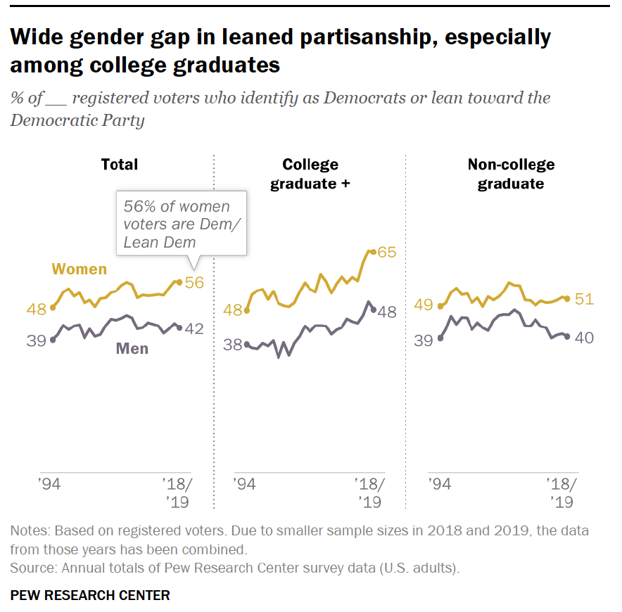
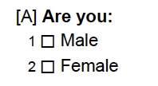
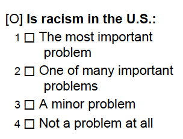

# Learning Objectives

- Working with R to create new variables and learning by summarizing.

- Demographics as explanation? 

- Functions: `mutate` , `ifelse` , `summarize`, `rename`, `count`

- Application: 2020 National Election Poll Michigan Exit Poll 

# 2020 MI Exit Poll

To do our data wrangling we are going to wrangle the 2020 National Exit Poll from the National Election Pool in the state of Michigan.

- We are going to use the actual data we got on Election Night!  

- But not much has been cleaned up since then so lots of work to do! (Ugh...). This is why the variables are sometimes unclear, there are extra value labels, etc.  Recall how we said that 80% of Data Science was data wrangling?  Well here is a gentle introduction to that working with relatively clean data.

{width=50%}

Now we will use the tools to help explore patterns of voting in Michigan in the 2020 presidential election.  

- Which voters tended to support which candidate?  

- How large are the differences in opinion between groups of voters thought to be politically relevant?

NOTE: This is exactly the kind of analysis that analysts do on Election Night (and thereafter).

- When doing data science you _always_ want to be question driven. There is a large amount of discretion in data science and well-defined questions help prevent you from pursuing spurious relationships. 

- The more data you have, the more likely you are to find relationships and results that are happenstance rather than real.

- Much of what we do in data science requires an argument: Why should I trust your data?  Why did you measure things the way you did? Do things change if I measure things differently? Or account for another potential explanation? 

{width=50%}

# Question: "Gender" Gap Among Younger Voters

Of historical interest: is there a difference in how men and women vote?  [Here](https://pewrsr.ch/3kUITya) is some background information from the Non-Profit Pew Research Center looking into the relationship between Gender and partisanship.  Note that the relationship is a **correlation** it is not a causal relationship and it certainly does not reveal what it is about gender that may be related to differences in the willingness to self-identify as a Republican or Democrat.

{width=50%}

Questions of Interest:

- How does the support for Biden and Trump vary for younger males and females?


- How does the "gender gap" vary by: age, race, and education?

To do this:

1. Create the variables needed for analysis (`mutate`)

2. Select the relevant data for analysis (`select`, `filter`)

3. Summarize/quantify the difference (using `mean`)

So all we need to do is to compare males vs. females?!?

But...

- Relevance of gender vs. sex?  What _exactly_ are we interested in?

- How measure?  Based on Voice? Self-Reported?




- How ask?  Do we worry about politically contested response categories affecting who responds?


- "Intersectional" comparisons? (by Age? And Race? And Ethnicity? And Religion? And...)

We are going to doing some abstract work to learn some tools and then apply what we need to answer the question.

```{r, message=FALSE}
library(tidyverse)

MI_final_small <- read_rds("../data/MI2020_ExitPoll_small.rds")

# Not run, but if you want to see the full data as well as the "cleaned" smaller version you can uncomment and run the following:
# load(file = "MI2020_ExitPoll.Rdata") 
```

# Renaming variables using `rename`

It is always good practice to have variables that have meaningful names so that you can determine what it contains without referring to some additional document.  The `rename` function allow us to do this.

Several of our variables were only asked of half the sample (the 2020 Michigan exit poll used two different sets of questionaires to try to ask more questions) and it may make sense for us to flag those variables so we now which data is missing because the question was skipped by the respondent and which data is missing because it was not asked.

```{r}
MI_final_small %>%
  rename(LGBT_split = LGBT,
         BRNAGAIN_split = BRNAGAIN,
         RACISM_split = RACISM20) %>%
  glimpse()
```

What did this do to `MI_final_small`?  Nothing.  If we want the changes to stick we need to define either a new tibble or else redefine `MI_final_small` to be the renamed tibble as follows.

```{r}
MI_final_small <- MI_final_small %>%
  rename(LGBT_split = LGBT,
         BRNAGAIN_split = BRNAGAIN,
         RACISM_split = RACISM20)
```

Usually we need to `rename` a variable only when we are first loading in a dataset.  And in this class you will likely never have to `rename` as we usually -- but not always -- give you clean data that is sensibly named.

Far more important and useful is the way in which we change variables using `mutate` (and, to a lesser extent, `transmute`).  The `mutate` function creates a new variable from an existing variable in the tibble -- leaving the existing variable in the tibble. As we will see, it is a powerful function that can be used in multiple ways.

# Renaming and recoding using `mutate`

One thing we can do is to create a new variable that is a function of an existing variable. In some ways this is recoding the variable to take on different values and saving that recoding as another variable. To begin we will create a variable called `FEMALE` that is simply the value of `SEX` minus 1.  Since `SEX` takes on a value of 2 for females and 1 for males, subtracting 1 will result in a variable that has the value of 1 for female respondents and 0 for male respondents.  This is useful because if we were to take the average value of `FEMALE` this would produce the percentage of female respondents in the sample. (In contrast, the mean of `SEX` lacks such an easily interpretable value.)

```{r}
MI_final_small <- MI_final_small %>%
      mutate(FEMALE = SEX - 1,
             WGT100 = WEIGHT*100) %>%
      glimpse() 
```

The other way to recode variables is to use the `ifelse` function to create a binary indicator variable that takes on two values. For example:

```{r}
MI_final_small %>%
  mutate(female.recode=ifelse(SEX==2,1,0)) %>%
  glimpse()
```

Note that R will automatically recognize the type and if the values are numeric or character the new mutation will be properly classified.  For example, `SEX.chr` is a character variable that takes on the value `Male` if the value of `SEX` is `1` and otherwise it takes on the value `Female`. `BidenVoter` is a numeric variable that takes on the value `1` if the voter reports voting for Biden and `0` otherwise. Similarly, `TrumpVoter` takes on the value `1` if the respondent reports voting for Trump and `0` otherwise.

```{r}
MI_final_small <- MI_final_small %>%
      mutate(SEX.chr = ifelse(SEX==1, "Male","Female"), 
             BidenVoter = ifelse(preschoice == "Joe Biden, the Democrat", 1 , 0),
             TrumpVoter = ifelse(preschoice == "Donald Trump, the Republican", 1 , 0)) %>%
      glimpse() 
```

Note how R recognizes the results of the mutation -- `SEX.chr` is a character variable (even though `SEX` was a double (numeric)) and `BidenVoter` and `TrumpVoter` are double (numeric) even though `preschoice` was a character variable.  R will define the variable according to the values being assigned.

Note also that the `ifelse` command creates a variable with two values and the second value is associated with all values that are not associated with the first condition.  In this case this means that voters who report voting for a candidate other than Biden or Trump will be a `0` in both variables! As a result, the variables are not really capturing the number of voters who support Biden relative to Trump as voters who support third party candidates are also being included as 0's in both.


But we can be clever in how we use `ifelse` to deal with multiple values.  For example, if we want to keep every value of a variable except for one we can use the following syntax to say that if the condition is not met to simply use the existing value of the variable.  So if we wanted to recode a valid response of a question to indicate that the data is actually missing (`NA`) we could use:

```{r}
MI_final_small %>%
  count(preschoice)
```
  
So now recode this!

```{r}
MI_final_small <- MI_final_small %>%
  mutate(preschoice=ifelse(preschoice=="Refused",NA,preschoice))

MI_final_small %>%
  count(preschoice)
```

Note that we can use the `ifelse` function in several clever ways.  First, we could do sequential mutations to do multiple recodings and R will process them in order.

```{r}
MI_final_small %>%
  mutate(preschoice=ifelse(preschoice=="Another candidate",NA,preschoice),
         preschoice=ifelse(preschoice=="Will/Did not vote for president",NA,preschoice),
         preschoice=ifelse(preschoice=="Undecided/Don’t know",NA,preschoice)) %>%
  drop_na(preschoice) %>%
  count(preschoice)
```

Or you can use conditionals to do recode for several values all at once using the conditionals we learned about last time! 

```{r}
MI_final_small <- MI_final_small %>%
  mutate(preschoice=ifelse(preschoice=="Another candidate" | preschoice=="Will/Did not vote for president" | preschoice == "Undecided/Don’t know",NA,preschoice))
```

The `ifelse` command is a powerful function -- even though it seems like it is useful only for binary (i.e., two-valued) variables it actually has a wide range of applications.

# Summarizing variables using `count`, `mutate` and `summarize` to Learn About the World

Always think about what is being defined when using `ifelse`.  To focus on Biden and Trump voters we could either include a `filter` before running the previous code chunk or we can just run it now.

```{r}
MI_final_small <- MI_final_small %>%
          filter(preschoice == "Joe Biden, the Democrat" | preschoice == "Donald Trump, the Republican")
```

A difference by gender with respect to what?  Vote Choice? Partisanship? Political opinions?  We are going to focus on vote choice, but you can replicate the code to look at anything in the data!

So how can we summarize the support for the various candidates.  One way is to use `count` to get the number of observations associated with each value.

```{r}
MI_final_small %>%
  count(preschoice)
```
But this is difficult to interpret -- why do we care about the number of respondents?  If we were to use this to forecast something we would be more interested in the proportion of voters who self-report supporting a particular candidate.

We can use the `mutate` function we just learned to create this when we realize the that the proportion of voters who support each candidate is simply the number of respondents who support a candidate over the total number of respondents who support either candidate.  Using the `sum` function, we can use `mutate` to create a new variable called `PctSupport` that is defined by the number of respondents who support each candidate over the sum of the number of respondents.

```{r}
MI_final_small %>%
  count(preschoice) %>%
  mutate(PctSupport = n/sum(n)) 
```
Seems like too many digits of scientific precision, so we can invoke the `round` function to clean it up if we want to.  We could do it in a single line, but we can also break it out for clarity.  The first mutation creates the variable `PctSupport` and then we mutate it to round it to 2 digits past the decimal point.  This highlights that we can mutate the same variable several times in the same mutation and the order of operation is from "top to bottom."

```{r}
MI_final_small %>%
  count(preschoice) %>%
  mutate(PctSupport = n/sum(n),
         PctSupport = round(PctSupport,digits=2)) 
```

Another way to get the percentage for a binary variable -- or to calculate the mean (or indeed any function) -- of any other variable is to use the `summarize` function that applies a function to summarize a variable in a requested way.  When dealing with a binary variable the mean is the same as the proportion with the value of 1.

```{r}
MI_final_small %>%
  summarize(PctBiden = mean(BidenVoter),
            PctTrump = mean(TrumpVoter))
```

The beauty of the summarize function is that we can use any predefined function to summarize a variable.  Here we are going to create a new tibble that contains the mean of the `BidenVoter` variable (names `PctBiden`), the standard deviation (`sd`) in the variable (`SDBiden`), the minimum value (`min`) in the `MinBiden` variable and the maximum value `max` in `MaxBiden`.  While the latter two are uninteresting given that we are working with a binary variable that only takes on a value of 1 or 0, it illustrates the power of `summarize`.

```{r}
MI_final_small %>%
  summarize(PctBiden = mean(BidenVoter),
            SDBiden = sd(BidenVoter),
            MinBiden = min(BidenVoter),
            MaxBiden = max(BidenVoter))
```

While we did not save anything this time -- the summary was produced and forgotten! -- it is possible to define a new tibble consisting of these summary statistics for later use if desired.

Returning to the question of summarizing the support for Biden and Trump, we can replicate the results of our counting code using the `summarize` function and then mutating the result so as to round the result as follows:

```{r}
MI_final_small %>%
  summarize(PctBiden = mean(BidenVoter),
            PctTrump = mean(TrumpVoter)) %>%
  mutate(PctBiden = round(PctBiden, digits = 2),
         PctTrump = round(PctTrump, digits = 2))
```

Note the dimensions of the resulting tibble -- `1 x 2` (1 row and 2 columns) -- as compared to the results of `count` (which was a 2 x 3 tibble).  

One important thing to always consider is whether your data has any missing data. Missing data in R is denoted by `NA` and it often requires special attention.  Consider, for example, responses to a question asking about the prevalence of racism in 2020.  As previously discussed, this question was only asked of half the sample.  



If we take a look at the number of responses associated with each response we get the following:

```{r}
MI_final_small %>%
  count(RACISM_split)
```

So 585 respondents were never asked the question.  Moreover, if we look at the question wording and response categories in the labelled questionnaire, we can see that 7 respondents have a value of 9 -- a value that is associated with them skipping the question when they took the survey (i.e., unit non-response in "survey-speak").

Consider 2 things: 1) what is the impact of the 585 `NA` responses on our ability to summarize the average value of `RACISM_split`, and 2) how can we recode the values of 9 to be missing.

Let's start with the former.  What happens if we run the following?

```{r}
MI_final_small %>%
  summarize(AvgImpRacism = mean(RACISM_split))
```

Huh?! Basically the missing data (`NA`) ends up crashing the computation and it prevents us from the missing data prevents us from calculating the mean.  To avoid this we need to tell R to calculate the mean after removing all missing data first.  

Using the `drop_na` function from before, we could also do:

```{r}
MI_final_small %>%
  drop_na(RACISM_split) %>%
  summarize(AvgImpRacism = mean(RACISM_split))
```

But because missing data is so prevalent, there is also a parameter within the `mean` function that allows us to remove missing data without having to first filter the data. To remove missing data we need to include: `na.rm=TRUE` as follows:

```{r}
MI_final_small %>%
  summarize(AvgImpRacism = mean(RACISM_split, na.rm=TRUE))
```

So now we have a mean, but we should be worried that the mean we just calculated is affected by the fact that the data coded respondents who skipped the question as having a value of 9.  So we need to recode them to be missing before taking the mean.  To do so we can use `mutate` and `ifelse` in a clever way.  Basically we are going to use `mutate` and `ifelse` to recode values that should be coded as missing (i.e., `RACISM_split==9`) as missing (i.e., `NA`) and if the values are OK to keep the values as recorded (i.e., the value is the value of `RACISM_split`).

So let's perform this mutation and then summarize. 

```{r}
MI_final_small %>%
    mutate(RACISM_split = ifelse(RACISM_split==9,NA,RACISM_split)) %>%
    summarize(AvgImpRacism = mean(RACISM_split, na.rm=TRUE))
```

Did it work?  You can tell that it did by looking at the fact that the resulting mean is now lower -- reflecting the fact that the values of `9` were removed. 

*Quick Exercise* How else could you confirm that the mutation worked?

```{r}
# INSERT CODE
```

*Quick Exercise* Using the code we covered, can you compare the opinions about the importance/prevalence of racism in the U.S. between Democrats (`PARTYID==1`), Republicans (`PARTYID==2`), and Independents (`PARTYID==3`)?  What do you observe?

```{r}
# INSERT CODE
```

# Enough screwing around, let's put this to work...

- What is the Gender gap in Michigan among the oldest and youngest voters? And which is larger -- gender differences or age differences?

We don't need to create seperate tibbles, but let's do so for practice.

```{r}
FemaleU24 <- MI_final_small %>%
  filter(FEMALE==1 & AGE10 == 1) %>%
  summarize(PctBiden = mean(BidenVoter)) %>%
  mutate(PctBiden = round(PctBiden, digits=2))

MaleU24 <- MI_final_small %>%
  filter(FEMALE==0 & AGE10 == 1) %>%
  summarize(PctBiden = mean(BidenVoter)) %>%
  mutate(PctBiden = round(PctBiden, digits=2))
```  

Now the difference we are interested in is simply the difference in the two tibbles.  Note that this works because the tibbles are identical in terms of their content (each is a single value consisting of `PctBiden`).  

```{r}
FemaleU24 - MaleU24
```

*Quick Exercise* How does this gap that compare to those who are above the age of 64? (i.e., those with AGE10 greater than or equal to `9`)

```{r}

# INSERT CODE HERE

```  

What do you conclude?  Which is a bigger effect: gender or age?  Are there reasons to be wary about this inference?

# Other Comparisons?  What does this all mean?

Try this out yourself! Using the value labels given by numeric codes on survey, how does presidential support vary by education?  Is there an Education gap (`EDUC18`)? Or a racial gap (`QRACEAI`)? Or a Religion gap (`BRNAGAIN`)?

Are there important inter-sectional differences -- differences by sex **and** education? Or sex **and** race?

Stepping back, what does it even mean to look at at opinions by gender/age/race?  Are we predicting? Describing? Are we (explicitly/implicitly) suggesting that there is a _causal_ relationship or that the differences are related to other experiences/aspects?  If so, is it misleading to focus on demographics rather than underlying events?  (And if so, why do so many continue to do so?)

NOTE: We will see another (better) way to do this using `group_by` when we get to conditional relationships.

Finally:

- How confident should we be based on _amount of data_?

- How confident should we be based on _how collected_? (i.e., who is included and excluded?)

\centering
*YOUR CONLUSIONS ARE ONLY AS GOOD AS THE DATA YOU HAVE!*

