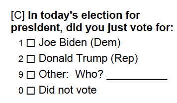

```{css,echo = F}
.small .remark-code { /*Change made here*/
  font-size: 85% !important;
}
.tiny .remark-code { /*Change made here*/
  font-size: 50% !important;
}
```

```{r,include=F}
set.seed(123)
options(width=60)
knitr::opts_chunk$set(fig.align='center',fig.width=9,fig.height=5)
def.chunk.hook  <- knitr::knit_hooks$get("chunk")
knitr::knit_hooks$set(chunk = function(x, options) {
  x <- def.chunk.hook(x, options)
  ifelse(options$size != "normalsize", paste0("\n \\", options$size,"\n\n", x, "\n\n \\normalsize"), x)
})
```

# Agenda

1. .blue[Research Camp]: 3 DS questions

2. Wrangling to answer

3. Preliminary **analysis**

---

# 3 Research Questions

--

- **Research Question**: Is education related with vote choice?

--

  - .blue[Theory]: Less educated hurt by free trade &rarr; Trump opposes free trade
  
  - .red[Data]: Examine vote choice by educational attainment
  
--

- **Research Question**: Is gender related with vote choice?

--

  - .blue[Theory]: Trump routinely expresses norm-breaking sexist views
  
  - .red[Data]: Examine vote choice by gender
  
--

- **Research Question**: Is race related with vote choice?

--

  - .blue[Theory]: Trump courts fringe white nationalist groups
  
  - .red[Data]: Examine vote choice by race
  
---

# (Re-)Opening the data

```{r,message = F}
require(tidyverse)
load('../output/MI_prepped.RData') # Now load the data you created
glimpse(MI_final)
```

---

# Wrangling Requires Looking

--

- How much is missing for the variables `EDUC18`, `SEX`, and `RACISM20`?

--

```{r}
MI_final %>%
  count(EDUC18)
```

---

# Look at the data

- How much is missing for the variables `LGBT`, `BRNAGAIN`, and `RACISM20`?

```{r}
MI_final %>%
  count(SEX)
```

---

# Look at the data
- How much is missing for the variables `LGBT`, `BRNAGAIN`, and `RACISM20`?

```{r}
MI_final %>%
  count(RACISM20)
```

---

# Look at the data

--

- `RACISM20` has 615 `NA` values!

--

- Some variables were only asked of half the sample

--

  - Polls often do this to avoid tiring out respondents
  
--

  - Random sampling &rarr; the half that received these questions are the same as the half that didn't
  
--

  - In other words, they are **representative** of each other
  
---

# Look at the data

- Are there other variables that were only asked of half the respondents?

--

```{r}
summary(MI_final %>% select(LGBT,BRNAGAIN,RACISM20,QLT20))
```

---

# Look at the data

- Were the same respondents asked the same questions?

```{r}
MI_final %>%
  select(LGBT,BRNAGAIN,RACISM20,QLT20) %>%
  drop_na(RACISM20)
```

---

# Look at the data

- No respondent answered all 4 questions!

```{r}
MI_final %>%
  select(LGBT,BRNAGAIN,RACISM20,QLT20) %>%
  drop_na()
```


---

# Look at the data

- They **either** were asked about `QLT20` **or** identity questions

```{r}
MI_final %>%
  select(LGBT,BRNAGAIN,RACISM20) %>%
  drop_na()
```


---

# Missingness

--

- Is there other missingness?

--

```{r}
MI_final %>%
  drop_na(RACISM20) %>%
  count(RACISM20)
```

--

- Unit non-response...8 respondents just skipped this question
  
--

  - Why not record these as `NA` too? Non-response might be interesting!
  
---

# `rename`

--

- Let's change the variable name for the three questions that were only asked of half the survey

```{r}
MI_final <- MI_final %>%
  rename(LGBT_split = LGBT,
         BRNAGAIN_split = BRNAGAIN,
         RACISM_split = RACISM20)
```

--

- NB: all we've done is change the names of `LGBT`, `BRNAGAIN`, and `RACISM20`.

```{r}
MI_final %>%
  select(matches('LGBT|BRNAGAIN|RACISM'))
```

---

# Recoding using `mutate`

--

- If we want to recode `SEX` to be more interpretable, we can use mutate

--

  - Currently, `SEX` is coded `1` for `Male` and `2` for `Female`
  
```{r}
MI_final %>%
  count(SEX)
```

--

  - What if we want to create a new variable that takes on the value `1` for `Female` and `0` for `Male`?

---

# Recoding using `mutate`

```{r}
MI_final %>%
  mutate(FEMALE = SEX - 1) %>%
  select(FEMALE,SEX)
```

---

# Recoding using `mutate`

- Alternatively, we could have used `ifelse` instead

--

```{r}
MI_final %>%
  mutate(FEMALE = ifelse(SEX == 2,1,0)) %>%
  select(FEMALE,SEX)
```


---

# Recoding using `mutate`

- "Dummy" variables allow us to calculate the mean to see the proportion of respondents who are `Female`

--

```{r}
MI_final <- MI_final %>%
  mutate(FEMALE = SEX - 1)

mean(MI_final$FEMALE,na.rm=T)
```

---

# Recoding using `mutate`

- In this case, it is easier to just use `SEX - 1`

--

- However, what if we wanted a `chr` version of the `SEX` variable?

```{r}
MI_final <- MI_final %>%
  mutate(SEX.chr = ifelse(SEX == 1,'Male','Female'))
```

--

- Or if the underlying variable wasn't numeric?

```{r}
MI_final <- MI_final %>%
  mutate(BidenVoter = ifelse(grepl('Biden',preschoice),1,0),
         TrumpVoter = ifelse(grepl('Trump',preschoice),1,0))
```

---

# The `else` of `ifelse`

--

- `ifelse([LOGIC],[VALUE IF TRUE],[VALUE IF FALSE])`

--

  - `ifelse(grepl('Biden',preschoice),1,0)`

--

  - If `Biden` is in the `preschoice`, return a `1`
  
--

  - Otherwise, return a `0`
  
--

- `0` captures Trump + Other + did not vote

<center></center>

---

# The `else` of `ifelse`

- We can set the `else` value to the variable itself

```{r}
MI_final %>%
  count(preschoice)
```


---

# The `else` of `ifelse`

- We can set the `else` value to the variable itself

```{r}
MI_final %>%
  mutate(choice2 = ifelse(preschoice == 'Refused',NA,preschoice)) %>%
  count(choice2)
```

---

# Sequential `ifelse`

--

```{r}
MI_final %>%
  mutate(preschoice = ifelse(grepl('Another',preschoice),NA,preschoice),
         preschoice = ifelse(grepl('Did not vote',preschoice),NA,preschoice),
         preschoice = ifelse(grepl('Undecided',preschoice),NA,preschoice)) %>%
  count(preschoice)
```

---

# Nested `ifelse`

- `ifelse([LOGIC],[IF TRUE],ifelse([LOGIC],[IF TRUE],[IF FALSE]))`

```{r}
MI_final %>%
  mutate(preschoice = ifelse(grepl('Another',preschoice),NA,
                             ifelse(grepl('Did not vote',preschoice),NA,
                                    ifelse(grepl('Undecided',preschoice),NA,preschoice)))) %>%
  count(preschoice)
```

---

# Combined `ifelse`

- Or more succinctly

```{r}
MI_final %>%
  mutate(preschoice = ifelse(grepl('Another|Did not vote|Undecided|Refused',preschoice),NA,preschoice)) %>%
  count(preschoice)
```

---

# Combining `count` with `mutate`

--

- Counts of respondents aren't as intuitive as proportions

```{r}
MI_final %>%
  filter(grepl('Biden|Trump',preschoice)) %>%
  count(preschoice) %>%
  mutate(PctSupport = n / sum(n))
```


---

# Wrangling Choices Matter!

```{r}
# Method 1
MI_final %>%
  filter(grepl('Biden|Trump',preschoice)) %>%
  count(preschoice) %>%
  mutate(PctSupport = n / sum(n))

# Method 2
MI_final %>%
  summarise(PctBiden = mean(BidenVoter),
            PctTrump = mean(TrumpVoter))
```

---

# Wrangling Choices Matter!

- Why are these different?!

--

- `filter()` means the **denominator is different**

```{r}
MI_final %>%
  filter(grepl('Biden|Trump',preschoice)) %>%
  summarise(PctBiden = mean(BidenVoter),
            PctTrump = mean(TrumpVoter))
```

---

# Other ways of summarizing

--

- Thus far, taking averages

--

- Can also look at `sd`, `median`, `min`, `max`

```{r}
MI_final %>%
  summarise(avgBiden = mean(BidenVoter),
            sdBiden = sd(BidenVoter),
            medBiden = median(BidenVoter),
            minBiden = min(BidenVoter),
            maxBiden = max(BidenVoter))
```

---

# Other ways of summarizing

--

- Could also just use `summary()`

```{r}
summary(MI_final$BidenVoter)
```

---

# Non-binary Variables

--

- Thus far, focusing on categorical data (`preschoice`) but treating it like a binary variable (only looking at Biden and Trump)

--

- What about `RACISM20`? (Don't forget that we `rename()`-ed it!)

--

```{r}
MI_final %>%
  count(RACISM_split)
```

---

# Non-binary Variables

--

- Does it make sense to take the average of this?

```{r}
MI_final %>%
  summarise(avgRacism = mean(RACISM_split))
```

--

- Don't forget about `NA`!

```{r}
MI_final %>%
  drop_na(RACISM_split) %>%
  summarise(avgRacism = mean(RACISM_split))
```

---

# Non-binary Variables

--

- But we also have unit non-response (coded as `9`)

```{r}
MI_final %>%
  count(RACISM_split)
```

- If we ignore this, we will over-estimate the degree to which Michigan voters don't think racism is a problem!

---

# Non-binary Variables

```{r}
MI_final %>%
  mutate(RACISM_split = ifelse(RACISM_split == 9,NA,RACISM_split)) %>%
  summarise(avgRacism = mean(RACISM_split,na.rm=T))
```

--

- What did we do?

--

  1. Converted `9` to `NA`
  2. Took the `mean()` with `na.rm=T` (equivalent to `drop_na(RACISM_split)`)
  
---

# Where is the .blue[science]?

--

- **Research Question**: Is education related with vote choice?

--

  - .blue[Theory]: Less educated hurt by free trade &rarr; Trump opposes free trade
  
  - .red[Data]: Examine vote choice by educational attainment

--

```{r}
MI_final %>%
  group_by(preschoice,EDUC18)
```

---

# Wrangle TMI

```{r}
MI_final <- MI_final %>%
  mutate(educ_3 = ifelse(EDUC18 == 1,'No College',
                         ifelse(EDUC18 == 2,'Some College',
                                ifelse(EDUC18 %in% 3:5,'College Degree',NA))))
MI_final %>%
  count(EDUC18,educ_3)
```

---

# Vote Choice by Education

--

- .blue[Theory]: Less educated should support Trump for **instrumental** reasons

```{r}
MI_final %>%
  group_by(educ_3) %>%
  summarise(TrumpVoter = mean(TrumpVoter,na.rm=T),
            totResp = n())
```

---

# Vote Choice by Education

- .blue[Theory]: Less educated should support Trump for **instrumental** reasons

```{r}
MI_final %>%
  group_by(TrumpVoter,educ_3) %>%
  count()
```

---

# Vote Choice by Education

```{r,fig.height=5}
MI_final %>%
  ggplot(aes(x = educ_3,fill = factor(TrumpVoter))) + 
  geom_bar(stat = 'count')
```

---

# Vote Choice by Education

```{r,fig.height=5}
MI_final %>%
  group_by(educ_3,TrumpVoter) %>%
  count() %>%
  ggplot(aes(x = educ_3,y = n,fill = factor(TrumpVoter))) + 
  geom_bar(stat = 'identity')
```

---

# Vote Choice by Education

```{r,fig.height=5}
MI_final %>%
  group_by(educ_3,TrumpVoter) %>%
  count() %>%
  ggplot(aes(x = reorder(educ_3,n),y = n,fill = factor(TrumpVoter))) + #<<
  geom_bar(stat = 'identity')
```


---

# Vote Choice by Education

- Is this a good plot?

--

  - Remember the .blue[theory]!
  
--

  - Want to know if less educated are more likely to vote Trump
  
--

- Let's calculate shares instead of counts

```{r}
p <- MI_final %>%
  group_by(educ_3,TrumpVoter) %>%
  count() %>%
  group_by(educ_3) %>%
  mutate(share = n / sum(n)) %>%
  ggplot(aes(x = reorder(educ_3,n),y = share,fill = factor(TrumpVoter))) + 
  geom_bar(stat = 'identity')
```

---

# Vote Choice by Education

```{r,fig.height=7,echo=F}
p
```

---

# Vote Choice by Education

- `NA` category is very small, but looks big

--

- Remove it with `drop_na(educ_3)`

```{r}
p <- MI_final %>%
  group_by(educ_3,TrumpVoter) %>%
  count() %>%
  group_by(educ_3) %>%
  mutate(share = n / sum(n)) %>%
  drop_na(educ_3) %>%
  ggplot(aes(x = reorder(educ_3,n),y = share,fill = factor(TrumpVoter))) + 
  geom_bar(stat = 'identity')
```


---

# Vote Choice by Education

```{r,fig.height=7,echo=F}
p
```

---

# Vote Choice by Education

- Remember the scientific method

```{r,echo=F,fig.height=3,fig.align='center',warning=F,message=F}
require(tidyverse)
data.frame(step = c('Observation','Question','Theory','Hypothesis','Data Collection',
                    'Analysis','Results','Conclusion'),
           Framework = c('Data','Science','Science','Science','Data','Data','Data','Science'),
           x = c(.5,1.5,2.5,3.5,4.5,5.5,6.5,7.5),
           xend = c(1.5,2.5,3.5,4.5,5.5,6.5,7.5,8.5),
           y = c(-.5,-1,-2,-.75,-2,-1,-.75,-.5),
           yend = c(.5,1,2,.75,2,1,.75,.5)) %>%
  ggplot(aes(x = x,y = y,fill = Framework)) + 
  geom_rect(aes(xmin = x,ymin = y,xmax = xend,ymax = yend)) + 
  # geom_rect(xmin = c(2.5),ymin = c(-2),xmax = c(3.5),ymax = c(2),fill = NA,color = 'black',lwd = 2,
  #           inherit.aes = F) + 
  # geom_rect(xmin = c(4.5),ymin = c(-2),xmax = c(5.5),ymax = c(2),fill = NA,color = 'black',lwd = 2,
  #           inherit.aes = F) + 
  scale_fill_manual(values = c('red','blue')) +
  theme(axis.text.y = element_blank(),
        panel.background = element_rect(fill = 'grey90'),
        panel.grid.major = element_blank(), panel.grid.minor = element_blank(),
        axis.ticks = element_blank(),
        plot.background = element_rect(
          fill = "grey90" #,
          # colour = "black",
          # size = 1
        ),
        axis.text.x = element_text(angle = 45,hjust = 1,size = 14)) + 
  scale_x_continuous(breaks = seq(1,8,by = 1),labels = c('Observation','Question','Theory','Hypothesis','Data Collection',
                                                         'Analysis','Results','Conclusion')) + 
  xlab(NULL) + ylab(NULL)
```

--

- We need to .blue[interpret] the .red[result] to answer the **research question**

--

  - "Less educated respondents are more likely to vote for Trump."
  
--

  - "Less educated respondents *in Michigan* **were** more likely to vote for Trump *in the 2020 U.S. Presidential Election*."

--

- How sure are we?

---

# More if there is time

- Differences in concern about racism by party

```{r}
MI_final %>%
  filter(PARTYID %in% c(1:3)) %>%
  mutate(RACISM_split = ifelse(RACISM_split == 9,NA,RACISM_split)) %>%
  group_by(PARTYID) %>%
  summarise(avgRacism = mean(RACISM_split,na.rm=T))
```

---

# Where is the .blue[science]?

- What does this mean?

<center></center>

---

# Visualizing Categorical Data

--

- Wrangle

```{r,message = F,size='small'}
require(sjlabelled)
lookupPid <- data.frame(vals = get_values(MI_final$PARTYID),
                        pid3 = get_labels(MI_final$PARTYID))
lookupRac <- data.frame(vals = get_values(MI_final$RACISM_split),
                        rac = get_labels(MI_final$RACISM_split))
toplot <- MI_final %>%
  filter(PARTYID %in% c(1:3)) %>%
  mutate(RACISM = ifelse(RACISM_split == 9,NA,RACISM_split)) %>%
  select(PARTYID,RACISM) %>%
  filter(complete.cases(.)) %>%
  left_join(lookupPid,by = c('PARTYID' = 'vals')) %>%
  left_join(lookupRac,by = c('RACISM' = 'vals')) %>%
  mutate(rac = factor(rac,
                      levels = c('The most important problem',
                                 'One of many important problems',
                                 'A minor problem',
                                 'Not a problem at all')))
```

---

# Visualizing Categorical Data

```{r,fig.width=9,fig.height=5}
toplot %>% 
  ggplot(aes(x = rac,fill = pid3)) +
  geom_bar(stat = 'count')
```

---

# Visualizing Categorical Data

```{r,fig.width=9,fig.height=5}
toplot %>% 
  ggplot(aes(x = rac,fill = pid3)) +
  geom_bar(stat = 'count',position = 'fill')
```
