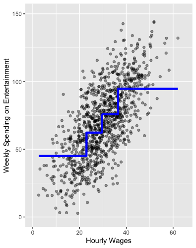
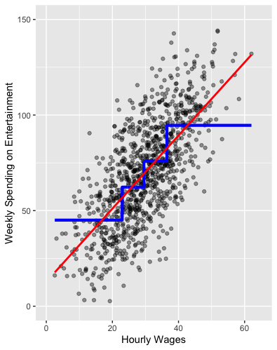

```{css,echo = F}
.small .remark-code { /*Change made here*/
  font-size: 85% !important;
}
.tiny .remark-code { /*Change made here*/
  font-size: 50% !important;
}
```

```{r,include=F}
set.seed(123)
options(width=60)
knitr::opts_chunk$set(fig.align='center',fig.width=9,fig.height=5)
def.chunk.hook  <- knitr::knit_hooks$get("chunk")
knitr::knit_hooks$set(chunk = function(x, options) {
  x <- def.chunk.hook(x, options)
  ifelse(options$size != "normalsize", paste0("\n \\", options$size,"\n\n", x, "\n\n \\normalsize"), x)
})
```

# Agenda

1. Regression Recap

2. Two ways to Evaluate

3. Introducing Cross Validation

---

# Regression Recap

--

- Regression very similar to **conditional means**

<center></center>

---

# Regression Recap

- Regression very similar to **conditional means**
  
<center></center>


---

# Regression Recap

- For this class, don't need to know how it happens

--

  - But the intuition is obvious
  
--

  - Given $Y = \alpha + \beta X$, just tweak $\alpha$ and $\beta$ to reduce **errors**
  
--

  - Once you've minimized all the errors, you have the **line of best fit**
  

---

# Evaluating Regression Results

- Understanding the **errors** helps us evaluate the model

--

- Define the errors $\varepsilon = Y - \hat{Y}$

--

  - True outcome values $Y$
  
  - Predicted outcome values $\hat{Y}$
  
--

- Useful to assess model performance

--

1. **Look** with univariate and multivariate visualization of the errors

2. Calculate the RMSE

---

# Introducing the .red[Data]

--

- New dataset on **movies**

--

  - Download `mv.Rds` to your `data` folder and load to object `mv`
  
  - `require` `tidyverse`, and `plotly` packages

```{r,message=F}
require(tidymodels)
require(tidyverse)
require(plotly)

mv <- readRDS('../data/mv.Rds')
```

---

# Looking at the .red[data]

```{r}
glimpse(mv)
```

---

# What is the .blue[science]?

--

- .blue[Theory]: the more a movie costs, the more it should make

--

  - If not, Hollywood would go out of business!
  
---

### Follow the process

--

1. What **type** of variables are earnings (`gross`) and costs (`budget`)?
  
```{r}
mv %>%
  select(gross,budget) %>% glimpse()
```

---

# Missingness

- TONS of missingness!

```{r}
summary(mv %>% select(gross,budget))
```

---

# Missingness

- What does this mean for "generalizability"

--

  - "Generalizability": Do our results with these data speak to other data?
  
```{r}
p <- mv %>%
  mutate(missing = ifelse(is.na(gross) | is.na(budget),1,0)) %>%
  group_by(year) %>%
  summarise(propMissing = mean(missing)) %>%
  ggplot(aes(x = year,y = propMissing)) + 
  geom_line()
```

---

# Missingness

- We can only speak to post-2000s Hollywood!

```{r}
p
```

---

# Some quick wrangling

```{r}
mv <- mv %>%
  drop_na(gross,budget)

mv %>%
  select(gross,budget) %>%
  glimpse()
```

--

- Looks like continuous measures to me!

---

# 2. Univariate Visualization

```{r}
mv %>%
  select(title,gross,budget) %>%
  gather(metric,value,-title) %>%
  ggplot(aes(x = value,color = metric)) + 
  geom_density()
```


---

# More Wrangling?

--

- Univariate visualization higlights significant **skew** in both measures

--

  - Most movies don't cost a lot and don't make a lot
  
--

  - But there are a few blockbusters that pull the density way out
  
--

- Let's **wrangle** two new variables that take the log of these skewed measures

--

  - Logging transforms skewed measures to more "normal" measures

```{r}
mv <- mv %>%
  mutate(gross_log = log(gross),
         budget_log = log(budget))
```

---

# 2. Univariate Visualization

```{r}
mv %>%
  select(title,gross_log,budget_log) %>%
  gather(metric,value,-title) %>%
  ggplot(aes(x = value,color = metric)) + 
  geom_density()
```

---

# NB: Could also use `ggplot`

```{r}
mv %>%
  select(title,gross,budget) %>%
  gather(metric,value,-title) %>%
  ggplot(aes(x = value,color = metric)) + geom_density() + 
  scale_x_log10(labels = scales::dollar) #<<
```

---

# 3. Conditional Analysis

--

- Continuous X continuous variables? Scatter with `geom_point()`!

```{r}
mv %>%
  ggplot(aes(x = budget,y = gross)) + 
  geom_point()
```

---

# 3. Conditional Analysis

--

- Why did I choose to put budget on the x-axis and gross on the y-axis?

--

  - Reveals .blue[assumption] about **causality**

--

- (BTW, I know I've been violating the tenets of data viz for several slides now. Let's fix that.)

```{r}
pClean <- mv %>%
  ggplot(aes(x = budget,y = gross)) + 
  geom_point() + 
  scale_x_log10(labels = scales::dollar) + 
  scale_y_log10(labels = scales::dollar) + 
  labs(title = "Movie Costs and Returns",
       x = "Costs (logged budget)",
       y = "Returns (logged gross)")
```

---

# 3. Conditional Analysis

```{r}
pClean
```

---

# 4. Regression!

```{r,message = F}
pClean + 
  geom_smooth(method = 'lm',se = F)
```

---

# Evaluation

--

- Every regression line makes mistakes

--

  - If they didn't, they wouldn't be good at **reducing complexity**!

--

- How bad do ours look?

--

  - How should we begin to answer this question!?
  
--

- Are there patterns to the mistakes?

--

  - We **overestimate** gross for movies that cost between $1m and $10m
  
--

  - These are the "indies"
  
--

  - We also **underestimate** gross to the "blockbusters"
  
--

- Why?

---

# Understanding Regression Lines

--

- Regression lines choose $\alpha$ and $\beta$ to minimize mistakes

--

  - Mistakes (aka "errors" or "residuals") are captured in the $\varepsilon$ term
  
--

  - We can apply the **process** to these!
  
```{r}
# geom_smooth is doing this behind the scenes
m <- lm(gross_log ~ budget_log,data = mv)
mv$predictions <- predict(m)
mv$errors <- mv$gross_log - mv$predictions

summary(mv$errors)
```

---

# Univariate Viz of Errors

```{r,message = F}
mv %>%
  ggplot(aes(x = errors)) + 
  geom_histogram() + 
  labs(x = 'Errors: Gross - Predicted',y = 'Number of movies')
```

---

# Univariate Viz of Errors

--

- Note that they are on average zero

--

  - Don't feel too proud! Mean 0 error is baked into the method
  
--

  - More concerned about **skew**...there is evidence of overestimating
  
--

- Can we do more? **Conditional Analysis**

--

  - Conditional on the x-axis?
  
--

  - Conditional on the **predicted values** (the line itself)
  
---

# Multivariate Viz of Errors

```{r,message = F}
mv %>%
  ggplot(aes(x = budget_log,y = errors)) + 
  geom_point() + geom_hline(yintercept = 0,linetype = 'dashed') + 
  scale_x_log10(label = scales::dollar) + geom_smooth()
```

---

# Multivariate Viz of Errors

- Ideal is where errors are unrelated to predictor

--

  - I.e., predictor and errors should be unrelated

--

- This is not the case for us!

--

  - Evidence of a U-shape &rarr; underpredict low and high budgets, overpredict middle budgets

---

# RMSE

--

- **E**rror ( $\varepsilon$ ): actual outcome ( $Y_i$ ) - predicted outcome ( $\hat{Y}_i$ )

--

  - The "distance" between the data and the model
  
--

- **S**quared: $\varepsilon^2$

--

  1. Makes all values positive
  
  2. .blue[Exaggerates] the presence of larger errors
  
--

- **M**ean: average these squared errors

--

- **R**oot: take their square root (.blue[un-exaggerate])

--

$$RMSE = \sqrt{\frac{1}{n}\sum_{i = 1}^n(Y_i - \hat{Y}_i)^2}$$

---

# RMSE

- **.red[E]**.red[rror] ( ${\color{red}\varepsilon}$ ): actual outcome ( $Y_i$ ) - predicted outcome ( $\hat{Y}_i$ )

  - The "distance" between the data and the model

- **S**quared: $\varepsilon^2$

  1. Makes all values positive
  
  2. Exaggerates the presence of larger errors

- **M**ean: average these squared errors

- **R**oot: take their square root (un-exaggerate)

$$RMS{\color{red}E} = \sqrt{\frac{1}{n}\sum_{i = 1}^n(\underbrace{Y_i - \hat{Y}_i}_{\varepsilon})^2}$$


---

# RMSE

- **E**rror ( $\varepsilon$ ): actual outcome ( $Y_i$ ) - predicted outcome ( $\hat{Y}_i$ )

  - The "distance" between the data and the model

- **.red[S]**.red[quared:] $\varepsilon^2$

  1. Makes all values positive
  
  2. Exaggerates the presence of larger errors

- **M**ean: average these squared errors

- **R**oot: take their square root (un-exaggerate)

$$RM{\color{red}S}E = \sqrt{\frac{1}{n}\sum_{i = 1}^n(\underbrace{\varepsilon)^2}_{S}}$$

---

# RMSE

- **E**rror ( $\varepsilon$ ): actual outcome ( $Y_i$ ) - predicted outcome ( $\hat{Y}_i$ )

  - The "distance" between the data and the model

- **S**quared: $\varepsilon^2$

  1. Makes all values positive
  
  2. Exaggerates the presence of larger errors

- **.red[M]**.red[ean: average these squared errors]

- **R**oot: take their square root (un-exaggerate)

$$R{\color{red}M}SE = \sqrt{\underbrace{\frac{1}{n}\sum_{i = 1}^n}_{M}(SE)}$$

---

# RMSE

- **E**rror ( $\varepsilon$ ): actual outcome ( $Y_i$ ) - predicted outcome ( $\hat{Y}_i$ )

  - The "distance" between the data and the model

- **S**quared: $\varepsilon^2$

  1. Makes all values positive
  
  2. Exaggerates the presence of larger errors

- **M**ean: average these squared errors

- **.red[R]**.red[oot: take their square root (un-exaggerate)]


$${\color{red}R}MSE = \sqrt{(MSE)}$$

---

# RMSE

--

- RMSE is a **single measure that summarizes model performance**

--

```{r}
e <- mv$gross_log - mv$predictions
se <- e^2
mse <- mean(se)
rmse <- sqrt(mse)
# Or
(rmseBudget <- sqrt(mean(mv$errors^2)))
```

--

- Is this good? Need to convert back out of logged values

---

# Predicting with uncertainty

- Say we're talking to investors about a new movie that costs $10m

--

  - How do we plug 10m into our model?
  
```{r}
summary(m)$coefficients
```

- $\hat{Y}_i = \alpha + \beta * X$

--

  - $\alpha = 1.26$ and $\beta = 0.96$
  
--

  - where $\hat{Y}_i$ is predicted gross (log) and $X$ is $10m budget (log)

--

```{r}
pred_gross_log <- 1.26 + 0.96*log(1e7)
```

---

# Predicted Gross

--

- To convert out of log, just `exp()`

```{r}
dollar(exp(pred_gross_log))
```

--

- Cool! We'll make $8.5m!

--

  - But we know our model isn't perfect
  
--

  - Need to adjust for it's errors via **RMSE**

---

# Incorporating RMSE

- Simple idea: add and subtract RMSE from this prediction

```{r}
pred_gross_log_ub <- 1.26 + 0.96*log(1e7) + sqrt(mean(mv$errors^2))
pred_gross_log_lb <- 1.26 + 0.96*log(1e7) - sqrt(mean(mv$errors^2))
dollar(exp(c(pred_gross_log_ub,pred_gross_log_lb)))
```

--

- So we'll either make a $56m profit or we'll lose almost $5m?

--

- **CONCLUSION**: maybe our model isn't very good?


---

# Introducing Cross Validation

- We ran a model on the full data and calculated the RMSE

--

- But this approach risks .red["overfitting"]

--

  - .red[Overfitting] is when we get a model that happens to do well on our specific data, but isn't actually that useful for predicting elsewhere.
  
--

  - "Elsewhere": Other periods, other movies, other datasets
  
--

- .blue[Theory:] Why care about **external validity**?

--

  - What is the point of measuring relationship if they don't generalize?
  
---

# Introducing Cross Validation

- In order to avoid .red[overfitting], we want to "train" our model on one part of the data, and then "test" it on a different part of the data.

--

  - Model "can't see" the test data &rarr; better way to evaluate performance
  
--

- Cross Validation: randomly split our data into a train set and test set

--

  - *Similar to bootstrapping*
  
---

# Introducing Cross Validation (CV)

```{r}
set.seed(1021)
# Create list of row numbers at random
inds <- sample(1:nrow(mv),size = round(nrow(mv)/2),replace = F) 

# Use slice(inds) to get training data
train <- mv %>% 
  slice(inds)

# Use slice(-inds) to get test data
test <- mv %>%
  slice(-inds)
```

--

- We now have two datasets of roughly the same number of observations!

---

# CV to Calculate RMSE

--

- We want to estimate a model based on the **test** data

--

- And evaluate RMSE based on the **train** data

```{r}
m2 <- lm(gross_log ~ budget_log,train)

# predict() function on a new dataset
test$preds <- predict(m2,newdata = test)

# Now calculate RMSE on the new dataset
e <- test$gross_log - test$preds
se <- e^2
mse <- mean(se,na.rm=T)
rmse <- sqrt(mse)
rmse
```

---

# CV to Calculate RMSE

- We did worse with CV! This is a *feature*

--

  - We are not being overconfident
  
--

  - We are avoiding "overfitting"
  
--

- Want to do this many times (like bootstrapping)

---

# CV to Calculate RMSE

```{r}
set.seed(123)
bsRes <- NULL
for(i in 1:100) {
  inds <- sample(1:nrow(mv),size = round(nrow(mv)/2),replace = F)
  
  train <- mv %>% slice(inds)
  test <- mv %>% slice(-inds)
  
  mTrain <- lm(gross_log ~ budget_log,train)
  
  test$preds <- predict(mTrain,newdata = test)
  
  rmse <- sqrt(mean((test$gross_log - test$preds)^2,na.rm=T))
  bsRes <- c(bsRes,rmse)
}

mean(bsRes)
```

---

# CV to Calculate RMSE

```{r}
data.frame(rmseBS = bsRes) %>%
  ggplot(aes(x = rmseBS)) + 
  geom_density() + 
  geom_vline(xintercept = mean(bsRes),linetype = 'dashed')
```


---

# Quiz & Homework

- Go to Brightspace and take the **11th** quiz

--

  - The password to take the quiz is `r paste(sample(1:9,size = 4,replace = T),collapse = '')`
  
--

- **Homework:**

--
  
  1. Work through Regression_part2_hw.Rmd